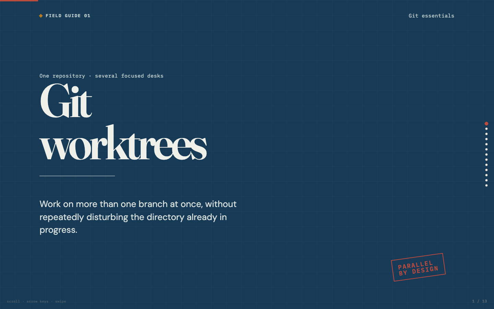

# Git worktrees — parallel branches, one repository

An interactive, browser-based presentation on Git worktrees. It explains the shared-repository model, safe lifecycle commands, branch-checkout protection, and the operational constraints that matter in practice.



## Live site

https://namuan.github.io/git-worktrees-presentation/

## Cheatsheet

Looking for commands rather than the presentation? See the [Git worktrees command cheatsheet](CHEATSHEET.md) — commands plus easy-to-remember aliases.

## Learning objective

Understand that a worktree is an additional working directory attached to one Git repository: it has separate checked-out files, `HEAD`, and index, while sharing repository history and most common Git data. The deck walks through an incident (feature in progress → urgent hotfix → cleanup) with an interactive visual model of the shared repo and its worktree directories.

## Presentation controls

- **Navigate** with arrow keys, scrolling, swipe gestures, or the dot navigation on the right.
- **Incident walkthrough** (slide 8): use the numbered phase strip to jump to any step, or Play/Pause/Step/Reset.
- **Playback speed**: Normal / Fast / Slow.
- **Accessibility**: keyboard navigation, `aria` labels on the interactive model, `prefers-reduced-motion` support.

## Run locally

The site is a single self-contained HTML file — no build step, no dependencies.

```sh
# Serve the directory (or just open index.html)
python3 -m http.server 4173
open http://localhost:4173
```

## Checks

```sh
npm run check   # validates structure, required content, and inline JS syntax
```

Optional browser QA (requires a Chromium build and playwright-core, see the webapp-qa skill):

```sh
python3 -m http.server 4173 &
node scripts/qa-smoke.mjs qa-smoke.json
node scripts/qa-audit.mjs qa-audit.json
```

## Intentional simplifications

- The interactive incident walkthrough is illustrative, not a Git executor. It compresses a real workflow into five phases.
- The deck focuses on normal linked worktrees; sparse checkouts, bare repositories, submodules, and project-specific tooling need separate consideration.
- Worktree isolation covers files, `HEAD`, and index — not every kind of state (ports, dependencies, caches, shared config).

## Sources

- [Git reference: git-worktree](https://git-scm.com/docs/git-worktree)
- [Git reference: gitworktrees](https://git-scm.com/docs/gitworktrees)
- [Pro Git: Git worktrees](https://git-scm.com/book/en/v2/Git-Tools-Advanced-Merging#_git_worktrees)

## License

MIT — see [LICENSE](LICENSE).
